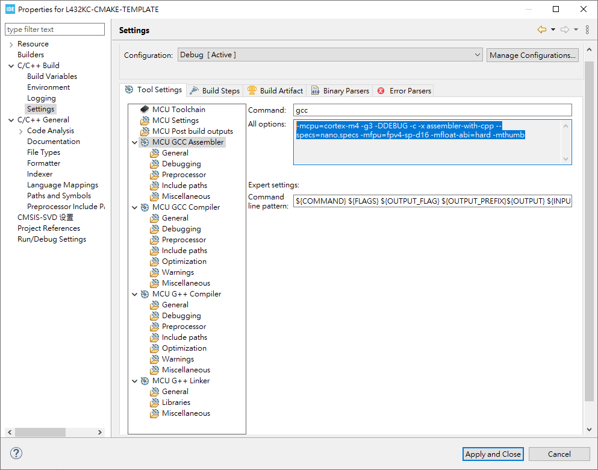
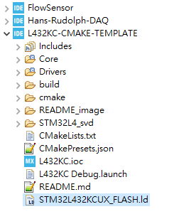
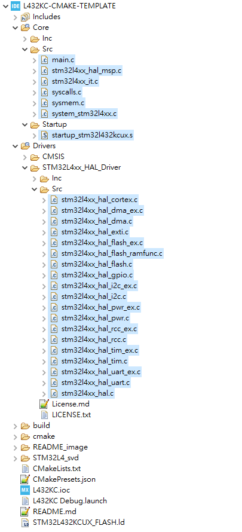
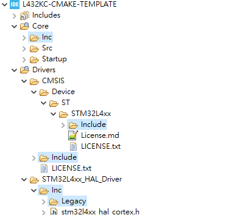
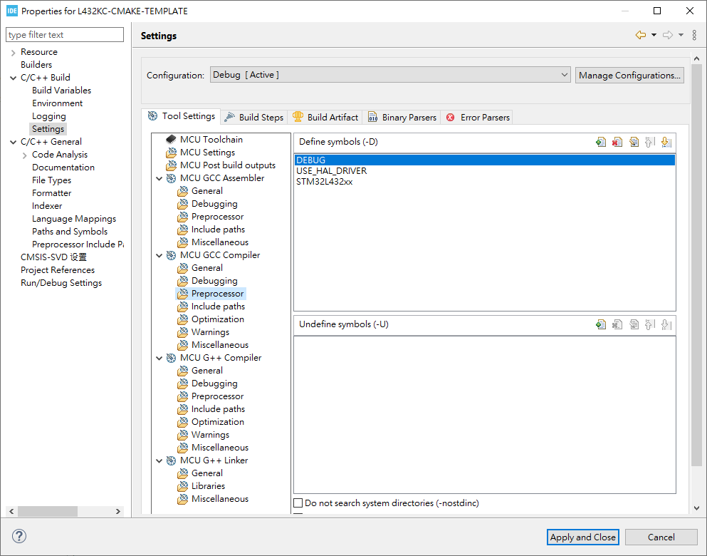

# Setting Up VS Code to Build STM32 Using CMake

## Toolchain

Download and place those in a centralized folder. Edit environment PATH for those folder or it's bin folder.

- ARM GNU for compile
> https://developer.arm.com/downloads/-/arm-gnu-toolchain-downloads
- CMake for easy execution of compile
> https://cmake.org/download/
- Ninja
> https://github.com/ninja-build/ninja/releases
- ST Link from Installing STM32CubeIDE
> c:\ST\STM32CubeIDE_$YOUR_VERSION_NUMBER$\STM32CubeIDE\plugins\com.st.stm32cube.ide.mcu.externaltools.stlink-gdb-server.win32_2.0.100.202109301221
- STM32_Programmer_CLI
> c:\ST\STM32CubeIDE_$YOUR_VERSION_NUMBER$\STM32CubeIDE\plugins\com.st.stm32cube.ide.mcu.externaltools.cubeprogrammer.win32_2.0.100.202110141430


Run CMD to check toolchain installation.

```
arm-none-eabi-gcc --version
STM32_Programmer_CLI --version
ST-LINK_gdbserver --version
cmake --version
ninja --version
```

## VS Code Extensions

Install those extensions to allow better programming environment.

- Ctrl + Shift + ` to open terminal, then enter (Shift + Ins) those command.
```
code --install-extension ms-vscode.cpptools
code --install-extension ms-vscode.cmake-tools
code --install-extension twxs.cmake
code --install-extension marus25.cortex-debug
code --install-extension dan-c-underwood.arm
code --install-extension zixuanwang.linkerscript

```

## CMake Configuration

### About CMakeLists.txt file

Every CMake-based application requires `CMakeLists.txt` file *in the root directory*, that describes the project and provides input information for build system generation.
> Root `CMakeLists.txt` file is sometimes called *top-level CMake* file

Essential things described in `CMakeLists.txt` file:

- Toolchain information, such as GCC configuration with build flags
- Project name
- Source files to build with compiler, C, C++ or Assembly files
- List of include paths for compiler to find functions, defines, ... (`-I`)
- Linker script path
- Compilation defines, or sometimes called *preprocessor defines* (`-D`)
- Cortex-Mxx and floating point settings for instruction set generation

### Prepare .cmak file

CMake needs to be aware about Toolchain we would like to use to finally compile the project with. This file will be universal across projects.

- Make new folder in project root: `cmake`
- Make new file in /cmake: `cmake/gcc-arm-none-eabi.cmake`

```cmake
set(CMAKE_SYSTEM_NAME               Generic)
set(CMAKE_SYSTEM_PROCESSOR          arm)

# Some default GCC settings
# arm-none-eabi- must be part of path environment
set(TOOLCHAIN_PREFIX                arm-none-eabi-)
set(FLAGS                           "-fdata-sections -ffunction-sections --specs=nano.specs -Wl,--gc-sections")
set(CPP_FLAGS                       "-fno-rtti -fno-exceptions -fno-threadsafe-statics")

# Define compiler settings
set(CMAKE_C_COMPILER                ${TOOLCHAIN_PREFIX}gcc ${FLAGS})
set(CMAKE_ASM_COMPILER              ${CMAKE_C_COMPILER})
set(CMAKE_CXX_COMPILER              ${TOOLCHAIN_PREFIX}g++ ${FLAGS} ${CPP_FLAGS})
set(CMAKE_OBJCOPY                   ${TOOLCHAIN_PREFIX}objcopy)
set(CMAKE_SIZE                      ${TOOLCHAIN_PREFIX}size)

set(CMAKE_EXECUTABLE_SUFFIX_ASM     ".elf")
set(CMAKE_EXECUTABLE_SUFFIX_C       ".elf")
set(CMAKE_EXECUTABLE_SUFFIX_CXX     ".elf")

set(CMAKE_TRY_COMPILE_TARGET_TYPE STATIC_LIBRARY)
```


### Prepare CMakeLists.txt file

We need to create main `CMakeLists.txt`, also called *root* CMake file.

> Make sure you really name it `CMakeLists.txt` with correct upper and lowercase characters.

Template File as below.

```cmake
cmake_minimum_required(VERSION 3.22)

# Setup compiler settings
set(CMAKE_C_STANDARD                17)
set(CMAKE_C_STANDARD_REQUIRED       ON)
set(CMAKE_C_EXTENSIONS              ON)
set(CMAKE_CXX_STANDARD              17)
set(CMAKE_CXX_STANDARD_REQUIRED     ON)
set(CMAKE_CXX_EXTENSIONS            ON)
set(PROJ_PATH                       ${CMAKE_CURRENT_SOURCE_DIR})
message("Build type: "              ${CMAKE_BUILD_TYPE})

#
# Core project settings
#
project(your-project-name)
enable_language(C CXX ASM)

#
# Core MCU flags, CPU, instruction set and FPU setup
# Needs to be set properly for your MCU
#
set(CPU_PARAMETERS
    -mthumb

    # This needs attention to properly set for used MCU
    -mcpu=cortex-m7
    -mfpu=fpv5-d16
    -mfloat-abi=hard
)

# Set linker script
set(linker_script_SRC               ${PROJ_PATH}/path-to-linker-script.ld)
set(EXECUTABLE                      ${CMAKE_PROJECT_NAME})

#
# List of source files to compile
#
set(sources_SRCS
    # Put here your source files, one in each line, relative to CMakeLists.txt file location
)

#
# Include directories
#
set(include_path_DIRS
    # Put here your include dirs, one in each line, relative to CMakeLists.txt file location
)

#
# Symbols definition
#
set(symbols_SYMB
    # Put here your symbols (preprocessor defines), one in each line
    # Encapsulate them with double quotes for safety purpose
)

# Executable files
add_executable(${EXECUTABLE} ${sources_SRCS})

# Include paths
target_include_directories(${EXECUTABLE} PRIVATE ${include_path_DIRS})

# Project symbols
target_compile_definitions(${EXECUTABLE} PRIVATE ${symbols_SYMB})

# Compiler options
target_compile_options(${EXECUTABLE} PRIVATE
    ${CPU_PARAMETERS}
    -Wall
    -Wextra
    -Wpedantic
    -Wno-unused-parameter
    # Full debug configuration
    -Og -g3 -ggdb
)

# Linker options
target_link_options(${EXECUTABLE} PRIVATE
    -T${linker_script_SRC}
    ${CPU_PARAMETERS}
    -Wl,-Map=${CMAKE_PROJECT_NAME}.map
    --specs=nosys.specs
    -u _printf_float                # STDIO float formatting support
    -Wl,--start-group
    -lc
    -lm
    -lstdc++
    -lsupc++
    -Wl,--end-group
    -Wl,--print-memory-usage
)

# Execute post-build to print size
add_custom_command(TARGET ${EXECUTABLE} POST_BUILD
    COMMAND ${CMAKE_SIZE} $<TARGET_FILE:${EXECUTABLE}>
)

# Convert output to hex and binary
add_custom_command(TARGET ${EXECUTABLE} POST_BUILD
    COMMAND ${CMAKE_OBJCOPY} -O ihex $<TARGET_FILE:${EXECUTABLE}> ${EXECUTABLE}.hex
)

# Convert to bin file -> add conditional check?
add_custom_command(TARGET ${EXECUTABLE} POST_BUILD
    COMMAND ${CMAKE_OBJCOPY} -O binary $<TARGET_FILE:${EXECUTABLE}> ${EXECUTABLE}.bin
)
```

Be sure to edit template for the following:
- Name your project.
> project(your-project-name)

- Match this to your ARM type
> -mcpu=cortex-m7
> -mfpu=fpv5-d16
> -mfloat-abi=hard



- Match this to your linker file name
> set(linker_script_SRC   ${PROJ_PATH}/path-to-linker-script.ld)


- Include all source file (.cpp .c)
> set(sources_SRCS


- Include all your header file path (.h)
> set(include_path_DIRS


- Define ARM and HAL variable
> set(symbols_SYMB


