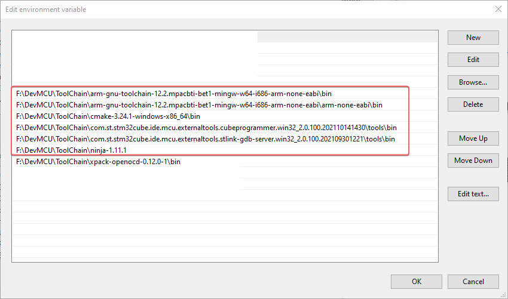
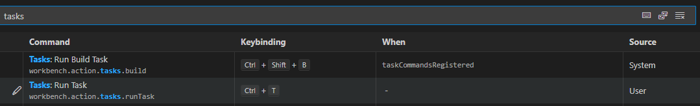

[](https://github.com/jasonyang-ee/STM32-CMAKE-TEMPLATE/actions/workflows/build-all.yml)


### Table of Content:
- [VS Code to Build and Debug STM32 Using CMake](#vs-code-to-build-and-debug-stm32-using-cmake)
	- [Toolchain](#toolchain)
		- [Essential Toolchain:](#essential-toolchain)
		- [Test Your Toolchain Installation:](#test-your-toolchain-installation)
	- [VS Code Extensions](#vs-code-extensions)
		- [Required Extension:](#required-extension)
		- [Comprehensive Extension List](#comprehensive-extension-list)
	- [CMake Configuration](#cmake-configuration)
		- [Prepare CMakeList.txt file](#prepare-cmakelisttxt-file)
		- [Prepare Toolchain file](#prepare-toolchain-file)
		- [Prepare MCU sepecific file](#prepare-mcu-sepecific-file)
		- [Prepare Source List and Include List file](#prepare-source-list-and-include-list-file)
		- [Prepare CMakePresets.json file](#prepare-cmakepresetsjson-file)
	- [Configure VS Code to be Ready for CMake](#configure-vs-code-to-be-ready-for-cmake)
	- [Build Project](#build-project)
- [Debug Project](#debug-project)
	- [Monitor Register Using SVG (System View Description) File](#monitor-register-using-svg-system-view-description-file)
- [Flash to Target](#flash-to-target)
	- [Setting of .gitignore](#setting-of-gitignore)
- [Docker Container for STM32 CMake \& Ninja Compiling](#docker-container-for-stm32-cmake--ninja-compiling)


# VS Code to Build and Debug STM32 Using CMake

Project using STM32L432KC as example. Test hardware is NUCLEO-L432KC.

Credit to: https://github.com/MaJerle/stm32-cube-cmake-vscode

This instruction will be focusing on Windows environment setup.


## Toolchain

- Download and prepare binary of each toolchain files in a centralized folder.

- Edit environment varialbe PATH to include those folder or it's `/bin` folder.

- ST Link tools are obtained by installing STM32CCubeIDE. Then, you will be able to find it in the installaiton folder.



### Essential Toolchain:

1. [ARM GNU](https://developer.arm.com/downloads/-/arm-gnu-toolchain-downloads)

2. [CMake](https://cmake.org/download/)

3. [Ninja](https://github.com/ninja-build/ninja/releases)

4. ST Link GDB Server (From CubeIDE Installation).

   Example Location:

   `C:\ST\STM32CubeIDE_$YOUR_VERSION_NUMBER$\STM32CubeIDE\plugins\com.st.stm32cube.ide.mcu.externaltools.stlink-gdb-server.win32_2.0.100.202109301221`

5. STM32_Programmer_CLI (From CubeIDE Installation)
   
   Example Location:
   
   `C:\ST\STM32CubeIDE_$YOUR_VERSION_NUMBER$\STM32CubeIDE\plugins\com.st.stm32cube.ide.mcu.externaltools.cubeprogrammer.win32_2.0.100.202110141430`


6. _Side Note: ST Link for Linux https://github.com/stlink-org/stlink_


### Test Your Toolchain Installation:

Run below commands in CMD to check toolchain installation.
```
arm-none-eabi-gcc --version
STM32_Programmer_CLI --version
ST-LINK_gdbserver --version
cmake --version
ninja --version
```


## VS Code Extensions

With the above toolchain and ST Link, you will be able to build and flash program into STM32 with command line. But, there's no sane person will do that everytime. Using VS Code Extension will simplify your `build` - `flash` - `debug` process.

### Required Extension:

```
CMake
CMake Tools
Cortex-Debug
Memory View
RTOS Views
```

> Install with command: `` Ctrl + Shift + ` `` to open terminal, then paste (Shift + Ins) those commands.
> ```shell
> code --install-extension twxs.cmake
> code --install-extension ms-vscode.cmake-tools
> code --install-extension marus25.cortex-debug
> code --install-extension mcu-debug.debug-tracker-vscode
> code --install-extension mcu-debug.memory-view
> code --install-extension mcu-debug.rtos-views
> ```


### Comprehensive Extension List

You can find a full list of my recommeded extensions in the `/.vscode/extensions.json` file.


## CMake Configuration

Every CMake-based application requires root `CMakeLists.txt` file *in the root directory*, that describes the project and provides input information for build system generation.

Essential things described in `CMakeLists.txt` file:

- Toolchain and compiler information
- Project name
- Source files to build with compiler, C, C++ or Assembly files
- List of include paths for compiler to find functions, defines, ... (`-I`)
- MCU sepecific compiler flags
- Linker script path
- Compilation defines, or sometimes called *preprocessor defines* (`-D`)


### Prepare CMakeList.txt file

This is the main CMake setup file.

- Make new file in project root: `CMakeList.txt`

- Modify `project name`, `linker file`, and `MCU sepecific setting`.

- If you are using this project folder structure, you may run the bash script `.\getIncludeList.sh` and `.\getSourceList.sh` to auto scan `/Application` folder for generating CMake source list.
  
- Otherwise, you will have to modify `/camke/IncludeList.cmake` and `/cmake/IncludeList.cmake`.

```makefile
# Define needed CMake verion
cmake_minimum_required(VERSION 3.22)


# Setup cmake module path and compiler settings
list(APPEND CMAKE_MODULE_PATH "${CMAKE_CURRENT_LIST_DIR}/cmake")
# Print current build type to console
message("Build type: "              ${CMAKE_BUILD_TYPE})
# Setup C and C++ version
set(CMAKE_C_STANDARD                11)
set(CMAKE_C_STANDARD_REQUIRED       ON)
set(CMAKE_C_EXTENSIONS              ON)
set(CMAKE_CXX_STANDARD              17)
set(CMAKE_CXX_STANDARD_REQUIRED     ON)
set(CMAKE_CXX_EXTENSIONS            ON)
set(CMAKE_EXPORT_COMPILE_COMMANDS   ON)
# Define current path for shorter reference below
set(PROJ_PATH                       ${CMAKE_CURRENT_SOURCE_DIR})
# Define .cmake module for toolchain compile flags that does holds true for all ARM projects
# This path is defined in the list() function above
set(CMAKE_TOOLCHAIN_FILE            gcc-arm-none-eabi)


# Project Name    --- MUST EDIT ---
project(L432KC-Template)
# Part of project name but made seperate for ease of editing project name
enable_language(C CXX ASM)
# Linker File     --- MUST EDIT ---
set(linker_script_SRC               ${PROJ_PATH}/Core/STM32L432KCUX_FLASH.ld)
# The use project name for binary file name
set(EXECUTABLE                      ${CMAKE_PROJECT_NAME})


# MCU Sepecific Setting    --- MUST EDIT ---
# Make multiple for various STM32 core
# This path is defined in the list() function above
include(STM32L432xx_HAL_PARA)

# .cmake module generated by using .\getIncludeList.sh and .\getSourceList.sh
# Those two file contains all the project source file list and include list
# This path is defined in the list() function above
include(SourceList)
include(IncludeList)


# Executable files
add_executable(${EXECUTABLE} ${source_list})
# Include paths
target_include_directories(${EXECUTABLE} PRIVATE ${include_list})
# Project symbols
target_compile_definitions(${EXECUTABLE} PRIVATE ${compiler_define})
# Compiler options
target_compile_options(${EXECUTABLE} PRIVATE
	${CPU_PARAMETERS}
	-Wall
	-Wpedantic
	-Wno-unused-parameter
)
# Linker options
target_link_options(${EXECUTABLE} PRIVATE
	-T${linker_script_SRC}
	${CPU_PARAMETERS}
	-Wl,-Map=${CMAKE_PROJECT_NAME}.map
	--specs=nosys.specs
	#-u _printf_float                # STDIO float formatting support
	-Wl,--start-group
	-lc
	-lm
	-lstdc++
	-lsupc++
	-Wl,--end-group
	-Wl,--print-memory-usage
)
# Execute post-build to print size
add_custom_command(TARGET ${EXECUTABLE} POST_BUILD
	COMMAND ${CMAKE_SIZE} $<TARGET_FILE:${EXECUTABLE}>
)
# Convert output to hex and binary
add_custom_command(TARGET ${EXECUTABLE} POST_BUILD
	COMMAND ${CMAKE_OBJCOPY} -O ihex $<TARGET_FILE:${EXECUTABLE}> ${EXECUTABLE}.hex
)
# Convert to bin file -> add conditional check?
add_custom_command(TARGET ${EXECUTABLE} POST_BUILD
	COMMAND ${CMAKE_OBJCOPY} -O binary $<TARGET_FILE:${EXECUTABLE}> ${EXECUTABLE}.bin
)
```


### Prepare Toolchain file

CMake needs to be aware about toolchain we would like to use to finally compile the project with. This file will be universal across projects.

- Make new folder in project root: `cmake`
- Make new file in folder /cmake: `./cmake/gcc-arm-none-eabi.cmake`

```makefile
set(CMAKE_SYSTEM_NAME               Generic)
set(CMAKE_SYSTEM_PROCESSOR          arm)

# Some default GCC settings
# arm-none-eabi- must be part of path environment
set(TOOLCHAIN_PREFIX                arm-none-eabi-)
set(FLAGS                           "-fdata-sections -ffunction-sections --specs=nano.specs -Wl,--gc-sections")
set(CPP_FLAGS                       "-fno-rtti -fno-exceptions -fno-threadsafe-statics")

# Define compiler settings
set(CMAKE_C_COMPILER                ${TOOLCHAIN_PREFIX}gcc ${FLAGS})
set(CMAKE_ASM_COMPILER              ${CMAKE_C_COMPILER})
set(CMAKE_CXX_COMPILER              ${TOOLCHAIN_PREFIX}g++ ${FLAGS} ${CPP_FLAGS})
set(CMAKE_OBJCOPY                   ${TOOLCHAIN_PREFIX}objcopy)
set(CMAKE_SIZE                      ${TOOLCHAIN_PREFIX}size)

set(CMAKE_EXECUTABLE_SUFFIX_ASM     ".elf")
set(CMAKE_EXECUTABLE_SUFFIX_C       ".elf")
set(CMAKE_EXECUTABLE_SUFFIX_CXX     ".elf")

set(CMAKE_TRY_COMPILE_TARGET_TYPE STATIC_LIBRARY)
```


### Prepare MCU sepecific file

Each MCU has their own ARM compiler flags. Those are defined in a individual module for portability.

```makefile
set(CPU_PARAMETERS ${CPU_PARAMETERS}
    -mthumb
    -mcpu=cortex-m4
    -mfpu=fpv4-sp-d16
    -mfloat-abi=hard
)

set(compiler_define ${compiler_define}
    "USE_HAL_DRIVER"
    "STM32L432xx"
)
```

> **To get ARM type from STM32CubeIDE:**


> **General rule for settings would be as per table below:**

| STM32 Family | -mcpu           | -mfpu         | -mfloat-abi |
| ------------ | --------------- | ------------- | ----------- |
| STM32F0      | `cortex-m0`     | `Not used`    | `soft`      |
| STM32F1      | `cortex-m3`     | `Not used`    | `soft`      |
| STM32F2      | `cortex-m3`     | `Not used`    | `soft`      |
| STM32F3      | `cortex-m4`     | `fpv4-sp-d16` | `hard`      |
| STM32F4      | `cortex-m4`     | `fpv4-sp-d16` | `hard`      |
| STM32F7 SP   | `cortex-m7`     | `fpv5-sp-d16` | `hard`      |
| STM32F7 DP   | `cortex-m7`     | `fpv5-d16`    | `hard`      |
| STM32G0      | `cortex-m0plus` | `Not used`    | `soft`      |
| STM32C0      | `cortex-m0plus` | `Not used`    | `soft`      |
| STM32G4      | `cortex-m4`     | `fpv4-sp-d16` | `hard`      |
| STM32H7      | `cortex-m7`     | `fpv5-d16`    | `hard`      |
| STM32L0      | `cortex-m0plus` | `Not used`    | `soft`      |
| STM32L1      | `cortex-m3`     | `Not used`    | `soft`      |
| STM32L4      | `cortex-m4`     | `fpv4-sp-d16` | `hard`      |
| STM32L5      | `cortex-m33`    | `fpv5-sp-d16` | `hard`      |
| STM32U5      | `cortex-m33`    | `fpv5-sp-d16` | `hard`      |
| STM32WB      | `cortex-m4`     | `fpv4-sp-d16` | `hard`      |
| STM32WL CM4  | `cortex-m4`     | `Not used`    | `soft`      |
| STM32WL CM0  | `cortex-m0plus` | `Not used`    | `soft`      |


### Prepare Source List and Include List file

Auto scan bash script has been made for STM32CubeMX generated files structure

- In terminal `` Ctrl + ` ``, run `.\getIncludeList.sh` and `.\getSourceList.sh`

- A list of scanned source and header will be saved in `/cmake` folder.

> You may modify bash file to expend the auto file searching for more folders.

> The bash simply scan `.c` `.cpp` `.s` file for source. And, it scan `/Inc` `/Include` for include path.


### Prepare CMakePresets.json file

`CMakePresets.json` provides definition for user configuration. Having this file allows developer to quickly change between debug and release mode.

- Create file `CMakePresets.json` in Project Root

```json
{
  "version": 3,
  "configurePresets": [
    {
      "name": "default",
      "hidden": true,
      "generator": "Ninja",
      "binaryDir": "${sourceDir}/build/${presetName}",
      "toolchainFile": "${sourceDir}/cmake/gcc-arm-none-eabi.cmake",
      "cacheVariables": {
      "CMAKE_EXPORT_COMPILE_COMMANDS": "ON"
      }
    },
    {
      "name": "Debug",
      "inherits": "default",
      "cacheVariables": {
      "CMAKE_BUILD_TYPE": "Debug"
      }
    },
    {
      "name": "RelWithDebInfo",
      "inherits": "default",
      "cacheVariables": {
      "CMAKE_BUILD_TYPE": "RelWithDebInfo"
      }
    },
    {
      "name": "Release",
      "inherits": "default",
      "cacheVariables": {
      "CMAKE_BUILD_TYPE": "Release"
      }
    },
    {
      "name": "MinSizeRel",
      "inherits": "default",
      "cacheVariables": {
      "CMAKE_BUILD_TYPE": "MinSizeRel"
      }
    }
  ]
}
```


## Configure VS Code to be Ready for CMake

While constructing your CMakeList.txt file, the extension will try to actively read the setting change and update the cache in /build folder, and this sometime will be messed up after mutiple iteration of trials.

Simply delete the entire `/build` folder and build project again as described below.


## Build Project

- Select configuration at bottom left. For example: `[DEBUG]`.

- Select `Build` to compile.


# Debug Project 

This is using VS Code `Tasks` feature and Extention `cortex-debug`

- Create `.vscode/launch.json`

```json
{
  "version": "0.2.0",
  "configurations": [
    {
      "name": "ST-Link",
      "cwd": "${workspaceFolder}",
      "executable": "${command:cmake.launchTargetPath}",
      "request": "launch",
      "type": "cortex-debug",
      "servertype": "stlink",
      "interface": "swd",
      "showDevDebugOutput": "both",
      "v1": false,                            // ST-Link version
      "device": "STM32L432KC",                // MCU used [optional]
      "serialNumber": "",                     // Set ST-Link ID if you use multiple at the same time [optional]
      "runToEntryPoint": "main",              // Run to main and stop there [optional]
      "svdFile": "STM32_svd/STM32L4x2.svd"    // SVD file to see registers [optional]

      // "servertype": "stlink", will try to run command "STM32_Programmer_CLI", "ST-LINK_gdbserver", and  which must exist in your system PATH.

      // If using SWO to see serial wire view, you will have to setup "servertype": "OpenOCD". Please refer to the extension github page to learn details.
    }
  ]
}
```

- Open debug tab. And our named debug preset `ST-Link` should be available to run `Green Icon` or `F5`.


## Monitor Register Using SVG (System View Description) File

- Download SVG file from [ST website/STM32XXXX/CAD Resources](https://www.st.com/en/microcontrollers-microprocessors/stm32l432kc.html#cad-resources)

- Place SVG file within project root and specify path in `launch.json`.


# Flash to Target

We are using VS Code Task `Ctrl + Shift + P` -> Enter `Tasks: run task`. This will allow auto excution of custom terminal commands.

Setting keyboard short cut `Ctrl + T` for this is going to help you very much.

- Create file `.vscode/tasks.json`

```json
{
  "version": "2.0.0",
  "tasks": [
    {
      "type": "shell",
      "label": "Windows: Flash Firmware",
      "command": "STM32_Programmer_CLI",
      "args": [
        "--connect",
        "port=swd",
        "--download",
        "${command:cmake.launchTargetPath}",
        "-rst",
        "-run"
      ],
      "options": {
        "cwd": "${workspaceFolder}"
      },
      "problemMatcher": []
    }
  ]
}
```


More task setting can be found in this project folder `.vscode/` for device reset, Linux flash, and cmake build.


## Setting of .gitignore

To avoid bloating the repository, please do not push build file. To have stable building process, docker with Github action is desired.

- Create file `.gitignore` in root folder.

> .gitignore rule:
```
build/
```

Optionally, you may still keep STM32CubeMX project for Pin Map management and code generation

Best practice is to track only `.ioc` file in CubeMX folder.

> .gitignore rule:
```
CubeMX/*
!CubeMX/*.ioc
```


# Docker Container for STM32 CMake & Ninja Compiling

### Dockerfile Details: https://github.com/jasonyang-ee/STM32-Dockerfile.git

-+- TL;DR -+-

This docker image auto clone an online git repo and compile the CMake & Ninja supported STM32 project locally on your computer with mounted volume.
```bash
docker run -v "{Local_Full_Path}":"/home" jasonyangee/stm32-builder:ubuntu-latest {Git_Repo_URL}
```


### Docker Image

Public Registry:
> ghcr.io/jasonyang-ee/stm32-builder:ubuntu-latest

> ghcr.io/jasonyang-ee/stm32-builder:alpine-latest

> ghcr.io/jasonyang-ee/stm32-builder:arch-latest

> jasonyangee/stm32-builder:ubuntu-latest

> jasonyangee/stm32-builder:alpine-latest

> jasonyangee/stm32-builder:arch-latest
