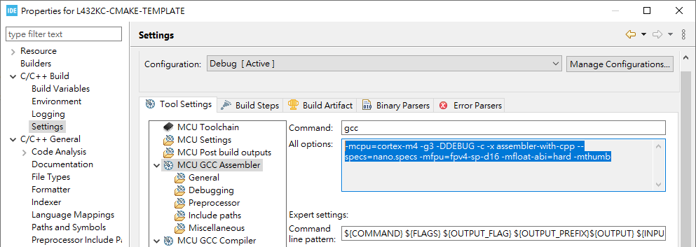
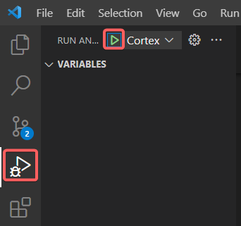
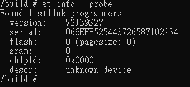

[](https://github.com/jasonyang-ee/STM32-CMAKE-TEMPLATE/actions/workflows/build_alpine.yml)
[](https://github.com/jasonyang-ee/STM32-CMAKE-TEMPLATE/actions/workflows/build_ubuntu.yml)
[](https://github.com/jasonyang-ee/STM32-CMAKE-TEMPLATE/actions/workflows/build_github.yml)


# 1. Setting Up VS Code to Build STM32 Using CMake

Project Using STM32L432KC as Example. Test hardware is NUCLEO-L432KC.


## 1.1. Toolchain

For Windows, download and place those in a centralized folder. Edit environment PATH for those folder or it's bin folder.

- [ARM GNU for compile](https://developer.arm.com/downloads/-/arm-gnu-toolchain-downloads)

- [CMake](https://cmake.org/download/)

- [Ninja](https://github.com/ninja-build/ninja/releases)

- [LLVM clang (Use win-64 installer with Add PATH option)](https://github.com/llvm/llvm-project/releases)

- ST Link GDB Server (From CubeIDE Installation) `C:\ST\STM32CubeIDE_$YOUR_VERSION_NUMBER$\STM32CubeIDE\plugins\com.st.stm32cube.ide.mcu.externaltools.stlink-gdb-server.win32_2.0.100.202109301221`

- STM32_Programmer_CLI (From CubeIDE Installation) `C:\ST\STM32CubeIDE_$YOUR_VERSION_NUMBER$\STM32CubeIDE\plugins\com.st.stm32cube.ide.mcu.externaltools.cubeprogrammer.win32_2.0.100.202110141430`


Run CMD to check toolchain installation.
```
arm-none-eabi-gcc --version
STM32_Programmer_CLI --version
ST-LINK_gdbserver --version
cmake --version
ninja --version
```


## 1.2. VS Code Extensions

Install those extensions to allow better programming environment.
```
Arm Assembly
CMake
CMake Tools
Cortex-Debug
LinkerScript
clang-format
```

Optionally: `` Ctrl + Shift + ` `` to open terminal, then enter (Shift + Ins) those command.
```shell
code --install-extension ms-vscode.cmake-tools
code --install-extension twxs.cmake
code --install-extension marus25.cortex-debug
code --install-extension dan-c-underwood.arm
code --install-extension zixuanwang.linkerscript
code --install-extension clang-format
```


## 1.3. CMake Configuration


Every CMake-based application requires root `CMakeLists.txt` file *in the root directory*, that describes the project and provides input information for build system generation.

Essential things described in `CMakeLists.txt` file:

- Toolchain information with cmake/.cmake file, such as GCC configuration with build flags
- Project name
- Source files to build with compiler, C, C++ or Assembly files
- List of include paths for compiler to find functions, defines, ... (`-I`)
- Linker script path
- Compilation defines, or sometimes called *preprocessor defines* (`-D`)
- Cortex-Mxx and floating point settings for instruction set generation


### 1.3.1. Prepare .cmake file

CMake needs to be aware about Toolchain we would like to use to finally compile the project with. This file will be universal across projects.

- Make new folder in project root: `cmake`
- Make new file in folder /cmake: `./cmake/gcc-arm-none-eabi.cmake`

> Template:

```makefile
set(CMAKE_SYSTEM_NAME               Generic)
set(CMAKE_SYSTEM_PROCESSOR          arm)

# Some default GCC settings
# arm-none-eabi- must be part of path environment
set(TOOLCHAIN_PREFIX                arm-none-eabi-)
set(FLAGS                           "-fdata-sections -ffunction-sections --specs=nano.specs -Wl,--gc-sections")
set(CPP_FLAGS                       "-fno-rtti -fno-exceptions -fno-threadsafe-statics")

# Define compiler settings
set(CMAKE_C_COMPILER                ${TOOLCHAIN_PREFIX}gcc ${FLAGS})
set(CMAKE_ASM_COMPILER              ${CMAKE_C_COMPILER})
set(CMAKE_CXX_COMPILER              ${TOOLCHAIN_PREFIX}g++ ${FLAGS} ${CPP_FLAGS})
set(CMAKE_OBJCOPY                   ${TOOLCHAIN_PREFIX}objcopy)
set(CMAKE_SIZE                      ${TOOLCHAIN_PREFIX}size)

set(CMAKE_EXECUTABLE_SUFFIX_ASM     ".elf")
set(CMAKE_EXECUTABLE_SUFFIX_C       ".elf")
set(CMAKE_EXECUTABLE_SUFFIX_CXX     ".elf")

set(CMAKE_TRY_COMPILE_TARGET_TYPE STATIC_LIBRARY)
```


### 1.3.2. Prepare CMakeLists.txt file

We need to create main `CMakeLists.txt`, also called *root* CMake file.

_Make sure you really name it `CMakeLists.txt` with correct upper and lowercase characters._


> Template:

```makefile
cmake_minimum_required(VERSION 3.22)

# Setup compiler settings
set(CMAKE_C_STANDARD                17)
set(CMAKE_C_STANDARD_REQUIRED       ON)
set(CMAKE_C_EXTENSIONS              ON)
set(CMAKE_CXX_STANDARD              17)
set(CMAKE_CXX_STANDARD_REQUIRED     ON)
set(CMAKE_CXX_EXTENSIONS            ON)
set(CMAKE_EXPORT_COMPILE_COMMANDS	ON)
set(PROJ_PATH                       ${CMAKE_CURRENT_SOURCE_DIR})
message("Build type: "              ${CMAKE_BUILD_TYPE})

# Setup .camke file location
set(CMAKE_TOOLCHAIN_FILE			"${CMAKE_CURRENT_SOURCE_DIR}/cmake/gcc-arm-none-eabi.cmake")

# Core project settings
project(your-project-name)
enable_language(C CXX ASM)

# Core MCU flags, CPU, instruction set and FPU setup
# Needs to be set properly for your MCU
set(CPU_PARAMETERS
    -mthumb

    # This needs attention to properly set for used MCU
    -mcpu=cortex-m7
    -mfpu=fpv5-d16
    -mfloat-abi=hard
)

# Set linker script
set(linker_script_SRC               ${PROJ_PATH}/path-to-linker-script.ld)
set(EXECUTABLE                      ${CMAKE_PROJECT_NAME})


# List of source files to compile
set(sources_SRCS
    # Put here your source files, one in each line, relative to CMakeLists.txt file location
)

# Include directories
set(include_path_DIRS
    # Put here your include dirs, one in each line, relative to CMakeLists.txt file location
)

# Symbols definition
set(symbols_SYMB
    # Put here your symbols (preprocessor defines), one in each line
    # Encapsulate them with double quotes for safety purpose
)

# Executable files
add_executable(${EXECUTABLE} ${sources_SRCS})

# Include paths
target_include_directories(${EXECUTABLE} PRIVATE ${include_path_DIRS})

# Project symbols
target_compile_definitions(${EXECUTABLE} PRIVATE ${symbols_SYMB})

# Compiler options
target_compile_options(${EXECUTABLE} PRIVATE
    ${CPU_PARAMETERS}
    -Wall
    -Wextra
    -Wpedantic
    -Wno-unused-parameter
    # Full debug configuration
    -Og -g3 -ggdb
)

# Linker options
target_link_options(${EXECUTABLE} PRIVATE
    -T${linker_script_SRC}
    ${CPU_PARAMETERS}
    -Wl,-Map=${CMAKE_PROJECT_NAME}.map
    --specs=nosys.specs
    -u _printf_float                # STDIO float formatting support
    -Wl,--start-group
    -lc
    -lm
    -lstdc++
    -lsupc++
    -Wl,--end-group
    -Wl,--print-memory-usage
)

# Execute post-build to print size
add_custom_command(TARGET ${EXECUTABLE} POST_BUILD
    COMMAND ${CMAKE_SIZE} $<TARGET_FILE:${EXECUTABLE}>
)

# Convert output to hex and binary
add_custom_command(TARGET ${EXECUTABLE} POST_BUILD
    COMMAND ${CMAKE_OBJCOPY} -O ihex $<TARGET_FILE:${EXECUTABLE}> ${EXECUTABLE}.hex
)

# Convert to bin file -> add conditional check?
add_custom_command(TARGET ${EXECUTABLE} POST_BUILD
    COMMAND ${CMAKE_OBJCOPY} -O binary $<TARGET_FILE:${EXECUTABLE}> ${EXECUTABLE}.bin
)
```


### 1.3.3. Edit template for the following project specific setting:

- Provide target name: `project`
- Match ARM type setting: `CPU_PARAMETERS`
- Point linker file path: `linker_script_SRC`
- Update source file list: `sources_SRCS`
- Update include path list: `include_path_DIRS`
- Define MCU Model and USE_HAL_DRIVER for HAL library users: `symbols_SYMB`


> **To get ARM type from STM32CubeIDE:**



> **General rule for settings would be as per table below:**

|STM32 Family | -mcpu           | -mfpu         | -mfloat-abi |
|-------------|-----------------|---------------|-------------|
| STM32F0     | `cortex-m0`     | `Not used`    | `soft`      |
| STM32F1     | `cortex-m3`     | `Not used`    | `soft`      |
| STM32F2     | `cortex-m3`     | `Not used`    | `soft`      |
| STM32F3     | `cortex-m4`     | `fpv4-sp-d16` | `hard`      |
| STM32F4     | `cortex-m4`     | `fpv4-sp-d16` | `hard`      |
| STM32F7 SP  | `cortex-m7`     | `fpv5-sp-d16` | `hard`      |
| STM32F7 DP  | `cortex-m7`     | `fpv5-d16`    | `hard`      |
| STM32G0     | `cortex-m0plus` | `Not used`    | `soft`      |
| STM32C0     | `cortex-m0plus` | `Not used`    | `soft`      |
| STM32G4     | `cortex-m4`     | `fpv4-sp-d16` | `hard`      |
| STM32H7     | `cortex-m7`     | `fpv5-d16`    | `hard`      |
| STM32L0     | `cortex-m0plus` | `Not used`    | `soft`      |
| STM32L1     | `cortex-m3`     | `Not used`    | `soft`      |
| STM32L4     | `cortex-m4`     | `fpv4-sp-d16` | `hard`      |
| STM32L5     | `cortex-m33`    | `fpv5-sp-d16` | `hard`      |
| STM32U5     | `cortex-m33`    | `fpv5-sp-d16` | `hard`      |
| STM32WB     | `cortex-m4`     | `fpv4-sp-d16` | `hard`      |
| STM32WL CM4 | `cortex-m4`     | `Not used`    | `soft`      |
| STM32WL CM0 | `cortex-m0plus` | `Not used`    | `soft`      |


### 1.3.4. Source File and Include Path

- Manually edit `sources_SRCS` and `include_path_DIRS` to capture all of your code file path.
- This must include startup file `startup_stm32xxxx.s`


### 1.3.5. Auto scan bash script has been made for STM32CubeMX generated files structure

- In terminal `` Ctrl + ` ``, run `.\getIncludeList.sh` and `.\getSourceList.sh`

- A list of scanned source and header will be saved in `/cmake` folder.

> You may modify bash file to expend the auto file searching for more folders.

> The bash simply scan `.c` `.cpp` `.s` file for source. And, it scan `/Inc` `/Include` for include path.


## 1.4. Prepare CMakePresets.json file

`CMakePresets.json` provides definition for user configuration. Having this file allows developer to quickly change between debug and release mode.

- Create file `CMakePresets.json` in Project Root

> Template:
```json
{
    "version": 3,
    "configurePresets": [
        {
            "name": "default",
            "hidden": true,
            "generator": "Ninja",
            "binaryDir": "${sourceDir}/build/${presetName}",
            "toolchainFile": "${sourceDir}/cmake/gcc-arm-none-eabi.cmake",
            "cacheVariables": {
                "CMAKE_EXPORT_COMPILE_COMMANDS": "ON"
            }
        },
        {
            "name": "Debug",
            "inherits": "default",
            "cacheVariables": {
                "CMAKE_BUILD_TYPE": "Debug"
            }
        },
        {
            "name": "RelWithDebInfo",
            "inherits": "default",
            "cacheVariables": {
                "CMAKE_BUILD_TYPE": "RelWithDebInfo"
            }
        },
        {
            "name": "Release",
            "inherits": "default",
            "cacheVariables": {
                "CMAKE_BUILD_TYPE": "Release"
            }
        },
        {
            "name": "MinSizeRel",
            "inherits": "default",
            "cacheVariables": {
                "CMAKE_BUILD_TYPE": "MinSizeRel"
            }
        }
    ]
}
```


## 1.5. Configure VS Code to be Ready for CMake

- Restart VS Code workspace to have CMake reading `CMakePresets.json` file.
- Cmake init commend will auto excute and construct `build` folder with `-G Ninja` option.


## 1.6. Build Project

- Select configuration at bottom left. For example: `[DEBUG]`.

- Select `Build` to compile.


# 2. Debug Project 

This is using VS Code `Tasks` feature and Extention `cortex-debug`

- Create `.vscode/launch.json`

>Template:

```json
{
    "version": "0.2.0",
    "configurations": [
        {
            "name": "Cortex Debug",
            "cwd": "${workspaceFolder}",
            "executable": "${command:cmake.launchTargetPath}",
            "request": "launch",
            "type": "cortex-debug",
            "servertype": "stlink",
            "device": "STM32L432KC",            	//MCU used
            "interface": "swd",                 	//Interface setup
            "serialNumber": "",                 	//Set ST-Link ID if you use multiple at the same time
            "runToEntryPoint": "main",          	//Run to main and stop there
            "svdFile": "STM32_svd/STM32L4x2.svd",	//SVD file to see registers
            "v1": false,
            "showDevDebugOutput": "both"

			// Will get automatically detected if STM32CubeIDE is installed to default directory or it can be manually provided if necessary..
            // "serverpath": "c:\\ST\\STM32CubeIDE_1.7.0\\STM32CubeIDE\\plugins\\com.st.stm32cube.ide.mcu.externaltools.stlink-gdb-server.win32_2.0.100.202109301221\\tools\\bin\\ST-LINK_gdbserver.exe",
            // "armToolchainPath": "c:\\ST\\STM32CubeIDE_1.7.0\\STM32CubeIDE\\plugins\\com.st.stm32cube.ide.mcu.externaltools.gnu-tools-for-stm32.9-2020-q2-update.win32_2.0.0.202105311346\\tools\\bin",
            // "stm32cubeprogrammer": "c:\\Program Files\\STMicroelectronics\\STM32Cube\\STM32CubeProgrammer\\bin",

            // If you use external loader, add additional arguments
            // "serverArgs": ["--extload", "path/to/ext/loader.stldr"],
        }
    ]
}
```


- Open debug tab. And our named debug preset `Cortex Debug` should be available to run (F5).




## 2.1. Monitor Register Using SVG (System View Description) File

- Download SVG file from [ST website/STM32XXXX/CAD Resources](https://www.st.com/en/microcontrollers-microprocessors/stm32l432kc.html#cad-resources)

- Place SVG file within project root and specifiy path in `launch.json`.

> Download of SVG file:


# 3. Flash to Target

Configuring the VS Code Run Task `Ctrl + Shift + P` -> type: `run task` -> `Enter` feature. This will allow auto excution of running custom terminal commands.

Setting keyboard short cut `Ctrl + T` for this is going to help you very much.

- Create file `.vscode/tasks.json`

> Template:

```json
{
	"version": "2.0.0",
	"tasks": [
		{
			"type": "shell",
			"label": "Windows: Flash Firmware",
			"command": "STM32_Programmer_CLI",
			"args": [
				"--connect",
				"port=swd",
				"--download",
				"${command:cmake.launchTargetPath}",
				"-rst",
				"-run"
			],
			"options": {
				"cwd": "${workspaceFolder}"
			},
			"problemMatcher": []
		}
	]
}
```

## 3.1. Setting of .gitignore

To avoid bloating the repository, please do not push build file. The have stable building process, docker with Github action is desired.

- Create file `.gitignore` in root folder.

> .gitignore rule:
```
build/
```

Optionally, you may still keep STM32CubeMX project for Pin Map management and code generation

Best practice is to track only `.ioc` file in CubeMX folder.

> .gitignore rule:
```
CubeMX/*
!CubeMX/*.ioc
```


# 4. Docker Container for STM32 CMake Compiling

## 4.1. Dockerfile

Dockerfile: https://github.com/jasonyang-ee/STM32-Dockerfile.git

Example Project: https://github.com/jasonyang-ee/STM32-CMAKE-TEMPLATE.git

## 4.2. Compiler

 - ARM GNU x86_64-arm-none-eabi  (939 MB)


## 4.3. Packages

- build-essential
- git
- cmake
- ninja-build
- stlink-tools


# 5. Use of This Image

This image is intended for building STM32 Microcontroller C/C++ Project Configured with CMake and Ninja.

`CMAKE_TOOLCHAIN_FILE` must be defined in your project CMakeList.txt file.

Default build type is `Release`.


- Help Menu
```bash
docker run jasonyangee/stm32_ubuntu:latest --help
```


## 5.1. Build Locally With Git Repo Link

- Format:
```bash
docker run IMAGE:VERSION {Git_Repo_URL}
```

- Example:
```bash
docker run --name builder jasonyangee/stm32_ubuntu:latest https://github.com/jasonyang-ee/STM32-CMAKE-TEMPLATE.git
```

- Optionally, you can copy out the binary files:
```bash
docker cp builder:/home/build/{TARGET_NAME}.elf
docker cp builder:/home/build/{TARGET_NAME}.bin
docker cp builder:/home/build/{TARGET_NAME}.hex
```


## 5.2. Build Locally With Mounted Volume

Replace the `Local/Host/Project/Path` with your actual project folder path on local machine.

Binary Output `.bin` `.elf` `.hex` are located in your `project/path/build`.

- Format:
```bash
docker run -v "{Local/Host/Project/Path}":"/build" IMAGE:VERSION /build
```

- Example:
```bash
docker run -v "F:\Project\STM32-CMAKE-TEMPLATE2":"/build" jasonyangee/stm32_ubuntu:latest
```


## 5.3. Build Online With Github Action

In the application Github repo, create file `.github\workflows\build.yml` with the following.

This action script will build and upload binary outout to artifact for download.

```yml
name: 'Build with Ubuntu Container'
on:
  push:
    branches:
      - main

jobs:
  BUILD_RELEASE:
    runs-on: ubuntu-latest
    container:
      image: 'jasonyangee/stm32_ubuntu:latest'
    steps:
    - uses: actions/checkout@v3
    - name: BUILD
      run: build.sh

    - name: Upload Binary .elf
      uses: actions/upload-artifact@v2
      with:
        name: BINARY.elf
        path: ${{ github.workspace }}/build/*.elf

	  - name: Upload Binary .bin
      uses: actions/upload-artifact@v2
      with:
        name: BINARY.bin
        path: ${{ github.workspace }}/build/*.bin
```


# 6. Build Image from Dockerfile

If you choose to build this image from Dockerfile.


## 6.1. User Modifications

**Check ARM releases at here: <https://developer.arm.com/downloads/-/arm-gnu-toolchain-downloads/>**

- Modify `ARM_VERSION=12.2.rel1` for enforcing compiler version.

- If pulling latest version is desired, insert this line before `curl` command

```docker
&& ARM_VERSION=$(curl -s https://developer.arm.com/downloads/-/arm-gnu-toolchain-downloads | grep -Po '<h4>Version \K.+(?=</h4>)') \
```


## 6.2. Pre Configured VS Code Tasks has been setup to build automatically

- Modify the build arguments in `.vscode/tasks.json` if you wish to have different image name.
```
stm32_ubuntu:latest",
```
- `Ctrl + Shift + p` and enter `run task` and choose the build options: `Build Ubuntu`.


## 6.3. Build Bash Command Example

```bash
docker build -t stm32_ubuntu:latest -f Dockerfile.ubuntu .
```


# 7. Manual Image Usage

- Override ENTRYPOINT to keep interactive mode live:
```
docker run -it --entrypoint /bin/bash jasonyangee/stm32_ubuntu:latest
```

- `cd` to your desired work directory

- Copy your files either using `> Docker cp` or `$ git clone`

- Initialize CMake:
```bash
cmake -DCMAKE_BUILD_TYPE=Release "-B build/" -G Ninja
```

- Compile:
```bash
cmake --build build/ -j 10
```


On pushing of the branch main, Github will automatically test build your application.


# 8. ST-Link

ST Link Programmer has not yet been automated.

## 8.1. Flash Device in Manual Usage

Tool Details: https://github.com/stlink-org/stlink

Using Windows machine is difficault to expose USB device to container.

Using WSL maybe the only option for now. See next section.

- Confirm Connnection:

```shell
st-info probe
```

- Manual Flash:

```shell
st-flash write {TARGET.bin} 0x8000000 --reset
```

- Manual Reset:
```shell
st-flash reset
```

## 8.2. Prepare USB Passthrough to WSL Docker Container
Follow this:
https://learn.microsoft.com/en-us/windows/wsl/connect-usb

- Run cmd (admin mode) on Windows:

```cmd
winget install --interactive --exact dorssel.usbipd-win
wsl --update
wsl --shutdown
```

- Run (restart) WSL Ubuntu:

```shell
sudo apt install linux-tools-5.4.0-77-generic hwdata
sudo update-alternatives --install /usr/local/bin/usbip usbip /usr/lib/linux-tools/5.4.0-77-generic/usbip 20
```


- Run cmd (admin mode) on Windows:

```cmd
usbipd list
```


- Note the ST-Link ID and bind it
```cmd
usbipd bind --busid 3-5
usbipd attach --busid 3-5
usbipd wsl list
```


## 8.3. Run Docker Container in WSL

- Run WSL Ubuntu:
```shell
docker run -it --privileged --entrypoint /bin/bash jasonyangee/stm32_ubuntu:latest
st-info --probe
```
Note: `--privileged` is necessary to allow device port passthrough




# 9. Github Action Variables

```c
vars.REGISTRY					// Github package link (private: ghcr.io  -  org: ghcr.io/Org_Name)
secrete.DOCKERHUB_TOKEN			// Docker Hub login token
secrete.DOCKERHUB_USERNAME		// Docker Hub username
secrete.TOKEN_GITHUB_PERSONAL	// Github package token
secrete.USER_GITHUB_PERSONAL	// Github package username
```

# 10. Github Badge

It is a good practice to include build result badge in application repo.

1. Nevigate to the action page, select the build workflow, and click create status badge:


2. Copy the badge markdown string:


3. Paste it to the top of your application README.md file to show build result


