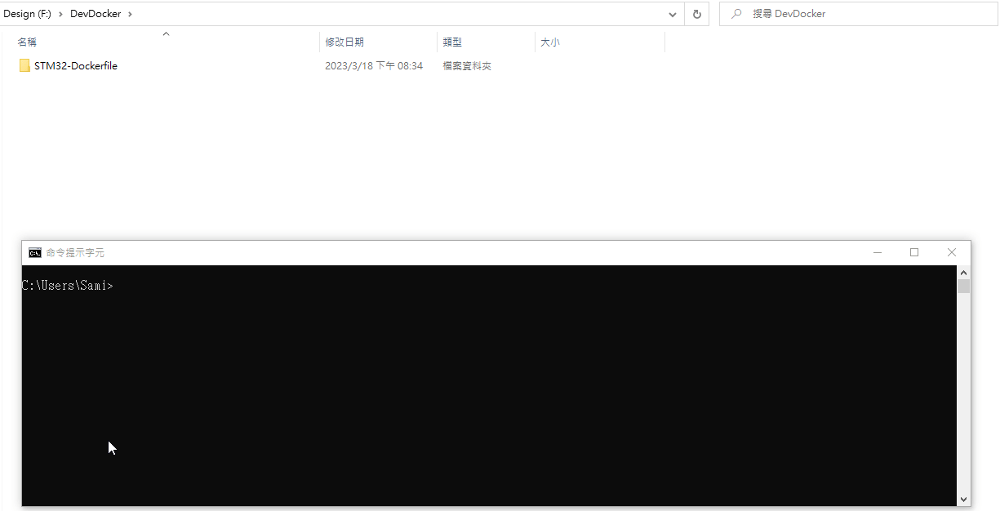

# Docker Container for STM32 CMake & Ninja Compiling


### Dockerfile Repository:

[https://github.com/jasonyang-ee/STM32-Dockerfile.git](https://github.com/jasonyang-ee/STM32-Dockerfile.git)

### Docker Image Documentation:

[https://doc.jasony.org/STM32-Dockerfile](https://doc.jasony.org/STM32-Dockerfile)


### Docker Image Usage:

-+- TL;DR -+-

This docker image auto clone an online git repo and compile the CMake & Ninja supported STM32 project locally on your computer with mounted volume.


```bash
docker run -v "{Local_Full_Path}":"/home" jasonyangee/stm32-builder:ubuntu-latest -r {Git_Repo_URL}
```

### Usage Demo:




### Docker Image Registry:

Public Registry:

> ghcr.io/jasonyang-ee/stm32-builder:ubuntu-latest

> ghcr.io/jasonyang-ee/stm32-builder:alpine-latest

> ghcr.io/jasonyang-ee/stm32-builder:arch-latest

> jasonyangee/stm32-builder:ubuntu-latest

> jasonyangee/stm32-builder:alpine-latest

> jasonyangee/stm32-builder:arch-latest
