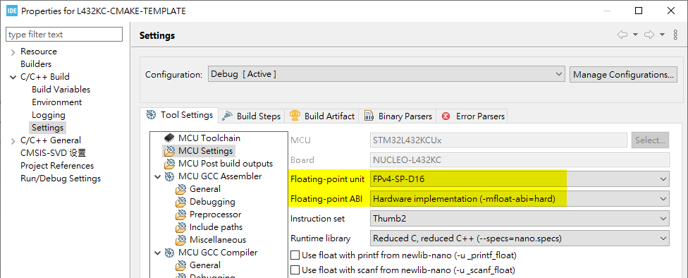

# Prepare MCU sepecific file

Each MCU has their own ARM compiler flags. Those are defined in a individual module for portability.

```makefile
set(CPU_PARAMETERS ${CPU_PARAMETERS}
    -mthumb
    -mcpu=cortex-m4
    -mfpu=fpv4-sp-d16
    -mfloat-abi=hard
)

set(compiler_define ${compiler_define}
    "USE_HAL_DRIVER"
    "STM32L432xx"
)
```

> **To get ARM type from STM32CubeIDE:**



> **General rule for settings would be as per table below:**

| STM32 Family | -mcpu           | -mfpu         | -mfloat-abi |
| ------------ | --------------- | ------------- | ----------- |
| STM32F0      | `cortex-m0`     | `Not used`    | `soft`      |
| STM32F1      | `cortex-m3`     | `Not used`    | `soft`      |
| STM32F2      | `cortex-m3`     | `Not used`    | `soft`      |
| STM32F3      | `cortex-m4`     | `fpv4-sp-d16` | `hard`      |
| STM32F4      | `cortex-m4`     | `fpv4-sp-d16` | `hard`      |
| STM32F7 SP   | `cortex-m7`     | `fpv5-sp-d16` | `hard`      |
| STM32F7 DP   | `cortex-m7`     | `fpv5-d16`    | `hard`      |
| STM32G0      | `cortex-m0plus` | `Not used`    | `soft`      |
| STM32C0      | `cortex-m0plus` | `Not used`    | `soft`      |
| STM32G4      | `cortex-m4`     | `fpv4-sp-d16` | `hard`      |
| STM32H7      | `cortex-m7`     | `fpv5-d16`    | `hard`      |
| STM32L0      | `cortex-m0plus` | `Not used`    | `soft`      |
| STM32L1      | `cortex-m3`     | `Not used`    | `soft`      |
| STM32L4      | `cortex-m4`     | `fpv4-sp-d16` | `hard`      |
| STM32L5      | `cortex-m33`    | `fpv5-sp-d16` | `hard`      |
| STM32U5      | `cortex-m33`    | `fpv5-sp-d16` | `hard`      |
| STM32WB      | `cortex-m4`     | `fpv4-sp-d16` | `hard`      |
| STM32WL CM4  | `cortex-m4`     | `Not used`    | `soft`      |
| STM32WL CM0  | `cortex-m0plus` | `Not used`    | `soft`      |

