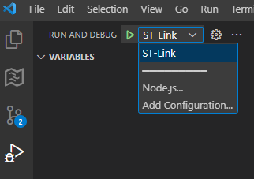
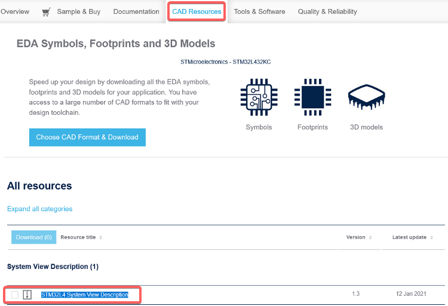

# Debug Project 

This is using VS Code `Tasks` feature and Extention `cortex-debug`

The configuration can be defined by creating `.vscode/launch.json`

> launch.json

```json
{
  "version": "0.2.0",
  "configurations": [
    {
      "name": "ST-Link",
      "cwd": "${workspaceFolder}",
      "executable": "${command:cmake.launchTargetPath}",
      "request": "launch",
      "type": "cortex-debug",
      "servertype": "stlink",
      "interface": "swd",
      "showDevDebugOutput": "both",
      "v1": false,                            // ST-Link version
      "device": "STM32L432KC",                // MCU used [optional]
      "serialNumber": "",                     // Set ST-Link ID if you use multiple at the same time [optional]
      "runToEntryPoint": "main",              // Run to main and stop there [optional]
      "svdFile": "STM32_svd/STM32L4x2.svd"    // SVD file to see registers [optional]

      // "servertype": "stlink", will try to run command "STM32_Programmer_CLI", "ST-LINK_gdbserver", and  which must exist in your system PATH.

      // If using SWO to see serial wire view, you will have to setup "servertype": "OpenOCD". Please refer to the extension github page to learn details.
    }
  ]
}
```


## Start Debugging

Open debug tab on the left.

Debug preset `ST-Link` should be available to run `Green Icon` or `F5`.




## Monitor Register Using SVG (System View Description) File

- Download SVG file from [ST website/STM32XXXX/CAD Resources](https://www.st.com/en/microcontrollers-microprocessors/stm32l432kc.html#cad-resources)

- Place SVG file within project root and specify path in `launch.json`.




